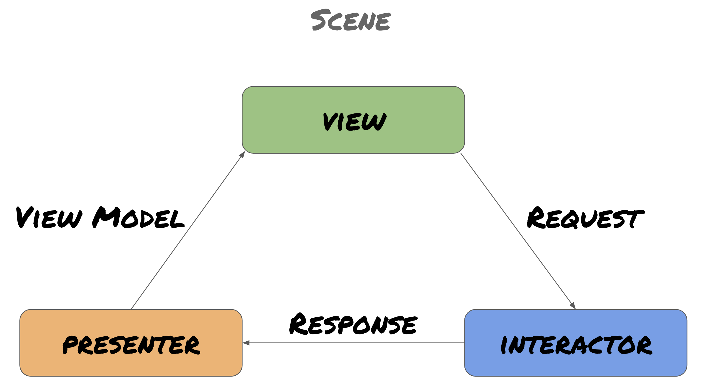

# MarvelCharacters

Marvel Characters is built in Swift with CleanSwift - VIP architecture, if you want to collaborate, make sure you use the Xcode Templates provided in the CleanSwift folder.

You can see all the Marvel's characters at a glance and see more details by tapping over the desired character card.

## *The life cicle:*


In a scene, the view make resquests to the interactor. The interactor is responsable of all CRUD operations (locally/DB and remote/API's) thru the repositories and deliver the response with the data to the presenter.

The presenter takes care of formatting all the data and build a ViewModel that is finally passed to the view for displaying.

The folder DataLayer, contains all the business logic of the application. ***Ideally, this logic should be in a separated framework***, so it could be reused across multiple targets and also it would been isolated from the client targets, which only would had access to the public repositories and data transfer models.

## _Requeriments_
- XcodeGen
- Xcode
- MacOS

## _Instructions to compile_
- Clone the repository
- run ```xcodegen generate``` to generate the xcodeproj
- Open the project
- Set the public/private keys of Marvel API. You can get yours at: [Marvel Developer Site](https://developer.marvel.com/account)

**¿How set the API Keys?** Add this to your Info.plist at Environment/Info.plist:
```
<key>MarvelApiKeys</key>
<dict>
	<key>private</key>
	<string>_________Your Private Key__________</string>
	<key>public</key>
	<string>_________Your Public Key__________</string>
</dict>
```

## _Dependencies_
- Hippolyte: Stub network calls for testing
- Lottie: Animations
- Kingfisher: Remote image download/cache management

## _Next steps_
- Add persistency to reduce the API requests, maybe with some rules to keep updated the information
- Show more information about the character in the details view by cosuming other endpoints of the Marvel's API
